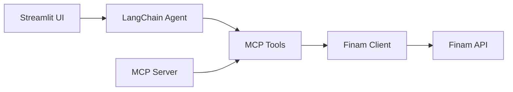

# Finam MCP API

> Интеграция Finam API с Model Context Protocol (MCP) и LangChain для создания AI-ассистента по торговле на бирже

🌐 **Наш репозиторий реализации MCP:**  
[github.com/mdmeldon/finam-mcp](https://github.com/mdmeldon/finam-mcp)

## 📋 Содержание

- [Описание проекта](#описание-проекта)
- [Возможности](#возможности)
- [Архитектура](#архитектура)
- [Требования](#требования)
- [Установка](#установка)
- [Конфигурация](#конфигурация)
- [Запуск](#запуск)
- [Использование](#использование)
- [Структура проекта](#структура-проекта)
- [Разработка](#разработка)

## 🎯 Описание проекта

Проект предоставляет два интерфейса для работы с Finam API:

1. **MCP-сервер** — набор инструментов для взаимодействия с Finam API через Model Context Protocol
2. **Streamlit UI** — веб-интерфейс с AI-ассистентом на базе LangChain для интеллектуального управления торговыми операциями

## ✨ Возможности

### Торговые операции

- 📊 Управление счетом и портфелем
- 📈 Размещение и отмена заявок
- 💹 Получение рыночных данных (котировки, стакан, исторические бары)
- 📉 Просмотр истории сделок и транзакций

### Рыночная информация

- 🕐 Серверное время Finam
- 🏢 Список торговых площадок
- 📜 Информация об инструментах
- 📅 Расписание торгов
- ⛓️ Цепочки опционов

### AI-ассистент (Streamlit UI)

- 💬 Диалоговый интерфейс для торговых операций
- 🤖 Интеграция с OpenRouter (GPT-4, Claude и др.)
- 📊 Визуализация портфеля и сделок
- 🔍 Поиск в интернете (DuckDuckGo)
- 🕒 Получение текущего времени

## 🏗️ Архитектура

Проект организован по принципам чистой архитектуры:

```
src/
├── application/          # Бизнес-логика и модели данных
│   ├── dtos.py          # Pydantic DTO для Finam API
│   ├── interfaces/      # Абстрактные интерфейсы (IClient)
│   └── exceptions/      # Доменные исключения
│
├── infrastructure/      # Инфраструктурные реализации
│   ├── core/           # Клиент Finam API с JWT
│   └── log/            # Настройка логирования
│
├── presentation/        # Интерфейсы и интеграции
│   ├── mcp/            # MCP-сервер и инструменты
│   ├── langchain/      # Streamlit UI и LangGraph агент
│   └── composition/    # DI-контейнеры (Dishka)
│
└── configs/            # Конфигурация (Pydantic Settings)
    ├── server.py       # Настройки MCP-сервера
    ├── langchain.py    # Настройки LangChain/OpenRouter
    └── logger.py       # Настройки логирования
```

### Поток данных



## 📋 Требования

- **Python**: 3.12 или выше
- **Система**: macOS, Linux, Windows
- **Инструменты**: uv (рекомендуется) или pip

## 🚀 Установка

### Вариант 1: С использованием uv (рекомендуется)

```bash
# Установка uv (если не установлен)
curl -LsSf https://astral.sh/uv/install.sh | sh

# Клонирование репозитория
git clone <repository-url>
cd MCP_FINAM

# Установка зависимостей
uv sync
```

### Вариант 2: С использованием pip

```bash
# Клонирование репозитория
git clone <repository-url>
cd MCP_FINAM

# Создание виртуального окружения
python -m venv .venv

# Активация виртуального окружения
# macOS/Linux:
source .venv/bin/activate
# Windows:
.venv\Scripts\activate

# Установка зависимостей
pip install -e .
```

## ⚙️ Конфигурация

### Шаг 1: Создание файла `.env`

Скопируйте пример конфигурации:

```bash
cp .env.example .env
```

### Шаг 2: Настройка переменных окружения

Отредактируйте файл `.env`:

```bash
# ============================================
# OpenRouter (для LangChain UI)
# ============================================
# Получите ключ на https://openrouter.ai/keys
OPENROUTER_API_KEY=sk-or-v1-...
OPENROUTER_BASE_URL=https://openrouter.ai/api/v1
OPENROUTER_MODEL=openai/gpt-4o-mini

# ============================================
# Finam API
# ============================================
# Получите токен в личном кабинете Finam
FINAM_API_TOKEN=your_finam_api_token_here
FINAM_ACCOUNT_ID=your_account_id_here

# ============================================
# MCP Server (опционально)
# ============================================
SERVER_APP_NAME=finam-mcp
SERVER_HOST=0.0.0.0
SERVER_PORT=8000
SERVER_NAMESPACE=dev
SERVER_AUTHOR=ctrl+alt+profit
```

### Получение ключей

#### OpenRouter API Key

1. Зарегистрируйтесь на [OpenRouter](https://openrouter.ai/)
2. Перейдите в раздел [Keys](https://openrouter.ai/keys)
3. Создайте новый API ключ
4. Скопируйте ключ в переменную `OPENROUTER_API_KEY`

#### Finam API Token

1. Войдите в [личный кабинет Finam](https://www.finam.ru/)
2. Перейдите в раздел API
3. Создайте новый токен для доступа к API
4. Скопируйте токен в переменную `FINAM_API_TOKEN`
5. Найдите ID вашего счета и скопируйте в `FINAM_ACCOUNT_ID`

## 🎮 Запуск

### Вариант 1: Streamlit UI с AI-ассистентом (рекомендуется)

Запуск веб-интерфейса с LangChain агентом:

```bash
# С использованием uv
uv run streamlit run server.py

# С использованием pip (в активированном venv)
python server.py
```

Приложение откроется в браузере по адресу: `http://localhost:8501`

**Возможности UI:**

- 💬 Диалог с AI-ассистентом
- 📊 Визуализация портфеля
- 📈 Графики сделок и производительности
- 🔑 Настройка API-ключей в интерфейсе
- 🗑️ Очистка визуализаций

### Вариант 2: MCP-сервер (для интеграции с другими приложениями)

Запуск MCP-сервера через stdio:

```bash
# С использованием uv
uv run python -m src

# С использованием pip (в активированном venv)
python -m src
```

MCP-сервер работает через stdio и предназначен для интеграции с другими приложениями, поддерживающими Model Context Protocol.

## 💡 Использование

### Примеры взаимодействия с AI-ассистентом

#### Получение информации о счете

```
Покажи информацию о моем счете
```

#### Размещение заявки

```
Купи 10 акций Сбербанка по рыночной цене
```

#### Получение котировок

```
Какая сейчас цена на GAZP?
```

#### Просмотр истории сделок

```
Покажи мои сделки за последнюю неделю с графиком
```

#### Анализ портфеля

```
Покажи структуру моего портфеля и его доходность
```

### Доступные MCP инструменты

#### Управление счетом

- `get_account` — получить информацию о счете
- `trades` — история сделок за период
- `transactions` — транзакции счета

#### Рыночные данные

- `clock` — текущее серверное время
- `exchanges` — список торговых площадок
- `get_asset` — информация об инструменте
- `get_asset_params` — торговые параметры инструмента
- `schedule` — расписание торгов
- `options_chain` — цепочка опционов

#### Заявки

- `place_order` — разместить новую заявку
- `get_order` — получить информацию о заявке
- `get_orders` — список всех заявок
- `cancel_order` — отменить заявку

#### Котировки и данные

- `bars` — исторические свечи
- `last_quote` — последняя котировка
- `latest_trades` — последние сделки
- `order_book` — стакан заявок

## 📁 Структура проекта

```
Finam/
├── src/
│   ├── __main__.py              # Точка входа MCP-сервера
│   ├── application/             # Бизнес-логика
│   │   ├── dtos.py             # Модели данных
│   │   ├── interfaces/         # Интерфейсы
│   │   └── exceptions/         # Исключения
│   ├── configs/                # Конфигурация
│   │   ├── __init__.py
│   │   ├── server.py           # Настройки MCP
│   │   ├── langchain.py        # Настройки LangChain
│   │   └── logger.py           # Настройки логов
│   ├── infrastructure/         # Инфраструктура
│   │   ├── core/              # Finam клиент
│   │   └── log/               # Логирование
│   └── presentation/          # Представление
│       ├── mcp/               # MCP-сервер
│       │   ├── main.py
│       │   └── handlers/      # MCP инструменты
│       ├── langchain/         # Streamlit UI
│       │   ├── main.py
│       │   ├── callback.py
│       │   ├── tools/         # LangChain инструменты
│       │   └── visualization/ # Визуализация
│       └── composition/       # DI контейнеры
│
├── server.py                   # Точка входа Streamlit
├── mcp_server.py              # Конфигурация MCP
├── pyproject.toml             # Зависимости
├── .env                       # Конфигурация (создать!)
├── .env.example               # Пример конфигурации
└── README.md                  # Этот файл
```

## 🛠️ Разработка

### Установка зависимостей для разработки

```bash
uv sync --dev
```

### Запуск тестов

```bash
# Запуск всех тестов
uv run pytest

# Запуск конкретного теста
cd test
bash run_test.sh
```

### Архитектурные принципы

1. **Чистая архитектура**: разделение на слои (application, infrastructure, presentation)
2. **Dependency Injection**: использование Dishka для управления зависимостями
3. **Типизация**: полная типизация с помощью Pydantic и type hints
4. **Асинхронность**: асинхронный клиент на базе aiohttp
5. **Конфигурация**: управление через переменные окружения (pydantic-settings)

### Добавление новых MCP инструментов

1. Добавьте метод в `IClient` интерфейс (`src/application/interfaces/client.py`)
2. Реализуйте метод в `FinamClient` (`src/infrastructure/core/finam_client.py`)
3. Создайте обёртку-инструмент в `src/presentation/mcp/handlers/client.py`
4. Зарегистрируйте инструмент в `init_tools` (`src/presentation/mcp/handlers/__init__.py`)

### Расширение LangChain агента

1. Добавьте новые инструменты в `src/presentation/langchain/tools/`
2. Зарегистрируйте инструменты в `create_langchain_app` (`src/presentation/langchain/main.py`)
3. При необходимости обновите промпт агента

## 📝 Логирование

Проект использует `structlog` для структурированного логирования:

- Логи выводятся в консоль с форматированием
- Уровень логирования настраивается через `LOGGER_LEVEL` в `.env`
- Добавляются контекстные процессоры для обогащения логов

## 🔐 Безопасность

- **Никогда не коммитьте `.env` файл** в git (добавлен в `.gitignore`)
- Храните API-ключи в безопасном месте
- Используйте переменные окружения для секретов
- JWT токены автоматически обновляются клиентом

## 📄 Лицензия

Этот проект является приватным проектом для использования с Finam API.

## 👥 Авторы

**ctrl+alt+profit**

## 🤝 Поддержка

Если у вас возникли вопросы или проблемы:

1. Проверьте, что все переменные окружения настроены правильно
2. Убедитесь, что используется Python 3.12+
3. Проверьте логи для диагностики проблем
4. Убедитесь, что Finam API токен действителен

## 🔄 Обновление

Для обновления зависимостей:

```bash
# С использованием uv
uv sync --upgrade

# С использованием pip
pip install --upgrade -e .
```

---

**Примечание**: Для работы с реальными торговыми операциями убедитесь, что вы понимаете риски торговли на бирже и используете корректные параметры заявок.
